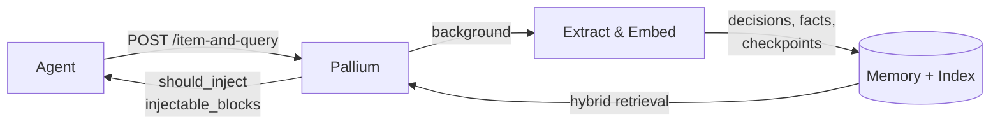

# Pallium

Local-first, multilingual memory sidecar for AI agents. Stores selected
evidence, derives compact memory, returns evidence-backed cards for follow-up
questions and resumed work.

## The Problem

Agents forget. They lose decisions made three threads ago, repeat
investigations, and resume interrupted work without the right context.

Pallium turns selected agent interactions into scoped, reusable memory —
structured conclusions and concrete facts, linked back to supporting evidence,
across languages. The agent gets small evidence-backed cards instead of noisy
transcripts or lossy summaries.

## Quick Example

Store a decision, then ask about it later:

```bash
# Ingest + query in one call (recommended pattern)
curl -X POST http://localhost:8000/item-and-query \
  -H 'Content-Type: application/json' -d '{
  "source_type": "chat_message",
  "source_id": "msg-042",
  "content_type": "text/plain",
  "content": "Why did we choose event time for reservation ordering?",
  "role": "user",
  "artifact_kind": "message",
  "container_ref": "channel:catalog-sync",
  "visibility": "container",
  "thread_ref": "thread-17"
}'
```

Pallium returns a compact memory card with an injection decision:

```json
{
  "should_inject": true,
  "decision_reason": "carry_forward_available",
  "injectable_blocks": [
    {
      "block_type": "memory_hit",
      "title": "decision",
      "text": "Use item event time for reservation ordering — avoids timezone drift.",
      "memory_type": "decision"
    }
  ]
}
```

The agent injects that card directly. No reranking, no local filtering — 
`should_inject` and `injectable_blocks` are the contract.

## Getting Started

```bash
python -m venv .venv
source .venv/bin/activate       # Windows: .venv\Scripts\activate
pip install -e ".[dev,vector]"
cp pallium.example.toml pallium.local.toml
cp .env.example .env.local
# Set your LLM API key in .env.local
```

Start the service and try the interactive harness:

```bash
python -m app.run --host 127.0.0.1 --port 8000 --processors 1
# In another terminal:
python -m app.agent_simulation chat-lite
```

The harness runs a thin-agent loop against the real HTTP endpoints — ask
repeated questions or resume interrupted work and inspect Pallium's memory
decisions.

See [docs/getting-started.md](docs/getting-started.md) for the full
walkthrough.

## How It Works



1. **Ingest** — selected evidence goes in via `POST /items` (not everything, just high-value events)
2. **Process** — background workers extract structured memory and concrete facts, then embed for retrieval
3. **Query** — `POST /query` retrieves compact memory + source evidence, scoped by visibility, with an injection decision
4. **Combined** — `POST /item-and-query` does ingest + query in one call (recommended for the common per-message pattern)
5. **Debug** — `POST /query/debug` or `POST /item-and-query/debug` exposes the full retrieval and routing trace

Two production packages run in parallel over the same evidence:

- **Work continuity** — decisions, investigation findings, resumed-work
  checkpoints, thread orientation ("why did we choose this?", "where did we
  leave off?")
- **Factual recall** — names, dates, preferences, events, relationships
  extracted from conversation threads, consolidated by subject and topic
  for multi-hop recall ("when did Jordan go camping?", "what activities
  does Melanie partake in?")

Retrieval combines lexical search, vector similarity, and hybrid RRF fusion.
The query path is deterministic by default, with selective LLM-assisted
disambiguation only for bounded ambiguous cases.

### Multilingual by Design

Pallium is designed to be multilingual. Memory is preserved in the original
language and cross-language recall works natively — a query in one language
can retrieve memory stored in another.

This is an intentional architectural property, not an undocumented side effect.
Tokenization, lexical scoring, content-overlap gates, and embedding are all
built to handle non-Latin scripts (Hebrew, Arabic, CJK, Cyrillic) as
first-class content.

See [docs/how-it-works.md](docs/how-it-works.md) for the full model.

## Scope

Good fit:
- agent-mediated conversations and follow-up questions
- resumed investigations or implementation work
- scoped public/private memory boundaries
- inspectable retrieval when results look wrong

Not a fit:
- transcript archive or raw event storage
- broad workspace or org-wide knowledge search
- agent runtime or workflow engine
- general-purpose vector database

## Benchmarks

Pallium is evaluated against external memory benchmarks to track retrieval
quality. These benchmarks were designed for long-context models or
general-purpose memory systems — Pallium is a structured retrieval sidecar, so
the numbers need context.

### LoCoMo — Conversational Fact Recall (ACL 2024)

Tests answering factual questions about multi-session conversations (names,
dates, events, relationships). End-to-end: question → retrieval → LLM answer →
judge.

| | Single-hop | Open-domain | Temporal | Multi-hop | Overall |
|---|---|---|---|---|---|
| **Pallium** | 61.1% | 61.6% | 44.8% | 43.3% | **57.1%** |

Comparison: ByteRover 96.1%, Mem0 66.9%, OpenAI Memory 52.9%.

**Why the gap to ByteRover?** Pallium extracts structured memory (decisions,
investigations, checkpoints) — not raw fact transcription. LoCoMo asks trivia
questions ("When did Caroline go camping?") that need atomic detail Pallium's
continuity-focused extraction intentionally abstracts away. Pallium's factual
recall package addresses this, but the architecture prioritizes reusable
conclusions over verbatim recall.

### FactConsolidation — Contradiction Handling (MemoryAgentBench, ICLR 2026)

Tests whether the system retrieves updated facts over stale contradictory ones.
Data contains counterfactual rewrites (e.g., "CEO of Microsoft is Steve Jobs"
replacing the real answer) — the system must return the update, not the
original.

**Pallium is a retrieval system, not an answer generator.** The meaningful
metric is retrieval rate (did the right fact reach the context?), not end-to-end
accuracy (did the evaluator LLM use it?).

| | Retrieval rate | End-to-end | Notes |
|---|---|---|---|
| **Single-hop** | **85%** | 63% | 22% gap = evaluator LLM overrides counterfactuals with real-world knowledge |
| **Multi-hop** | **28%** | 9.2% | Matches GPT-4o long-context (28%); multi-hop contradiction is unsolved across all systems |

Comparison (end-to-end, published baselines): GPT-4o 60%/5%, BM25 RAG 45%/6%,
Mem0 20%/0%, Zep 10%/0%.

**Why report retrieval rate separately?** The 22-point gap between retrieval
(85%) and end-to-end (63%) on single-hop is entirely the evaluator LLM
preferring its training knowledge over absurd counterfactuals in context. When
Pallium surfaces the right fact and the LLM uses it, accuracy is 100%. That
gap is the consuming agent's problem, not the memory system's.

### Running Benchmarks

```bash
python -m evals.locomo_benchmark --download
python -m evals.locomo_benchmark --mini --cache-dir .local/llm-cache
python -m evals.mabench_benchmark --download
python -m evals.mabench_benchmark --mini --cache-dir .local/llm-cache
```

## Documentation

- [Getting Started](docs/getting-started.md) — local setup to first query
- [Demo Session](examples/demo-session.md) — complete walkthrough with real API requests, memory creation, cross-thread recall, and debug trace
- [How It Works](docs/how-it-works.md) — architecture, memory model, retrieval
- [HTTP API](docs/http-api.md) — endpoints, request/response shapes, examples
- [Configuration](docs/configuration.md) — providers, packages, tuning knobs
- [Agent Integration](docs/agent-integration.md) — wiring Pallium into a runtime
- [Integration Example](docs/integration-example.md) — Slack agent walkthrough with code
- [Privacy and Visibility](docs/privacy-and-visibility.md) — scoped memory boundaries
