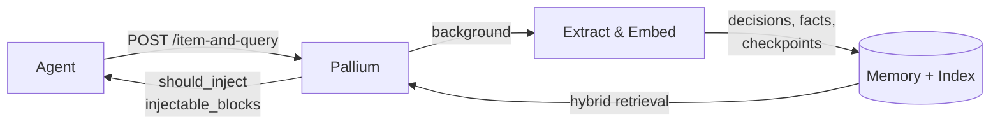

# Pallium

Memory sidecar for AI agents. Extracts structured memory from conversations
— decisions, facts, investigation outcomes, work checkpoints — and returns
compact evidence-backed cards when the agent needs context from earlier
threads.

Multilingual by design: queries in one language retrieve memory stored in
another. Local-first, no cloud dependencies.

## What It Looks Like

Thread 1: your agent helps debug a deployment issue. After investigation,
it decides to use event timestamps for ordering. Pallium extracts and stores
the decision with its evidence.

Thread 2 (days later): a colleague asks "why do we use event time for
ordering?" Pallium returns a compact card:

    decision: "Use event time for reservation ordering — avoids timezone drift."
    evidence: thread-A, 2024-03-15

The agent answers immediately with the original reasoning — no
re-investigation, no guessing, no pasting from old threads.

## Quick Example

Store a decision, then ask about it later:

```bash
# Ingest + query in one call (recommended pattern)
curl -X POST http://localhost:8000/item-and-query \
  -H 'Content-Type: application/json' -d '{
  "source_type": "chat_message",
  "source_id": "msg-042",
  "content_type": "text/plain",
  "content": "Why did we choose event time for reservation ordering?",
  "role": "user",
  "artifact_kind": "message",
  "container_ref": "channel:catalog-sync",
  "visibility": "container",
  "thread_ref": "thread-17"
}'
```

Pallium returns a compact memory card with an injection decision:

```json
{
  "should_inject": true,
  "decision_reason": "carry_forward_available",
  "injectable_blocks": [
    {
      "block_type": "memory_hit",
      "title": "decision",
      "text": "Use item event time for reservation ordering — avoids timezone drift.",
      "memory_type": "decision"
    }
  ]
}
```

The agent injects that card directly. No reranking, no local filtering — 
`should_inject` and `injectable_blocks` are the contract.

## Getting Started

```bash
python -m venv .venv
source .venv/bin/activate       # Windows: .venv\Scripts\activate
pip install -e ".[dev,vector]"
cp pallium.example.toml pallium.local.toml
cp .env.example .env.local
# Set your LLM API key in .env.local
```

Start the service and try the interactive harness:

```bash
python -m app.run --host 127.0.0.1 --port 8000 --processors 1
# In another terminal:
python -m app.agent_simulation chat-lite
```

The harness runs a thin-agent loop against the real HTTP endpoints — ask
repeated questions or resume interrupted work and inspect Pallium's memory
decisions.

See [docs/getting-started.md](docs/getting-started.md) for the full
walkthrough.

## How It Works



1. **Ingest** — selected evidence goes in via `POST /items` (not everything, just high-value events)
2. **Process** — background workers extract structured memory and concrete facts, then embed for retrieval
3. **Query** — `POST /query` retrieves compact memory + source evidence, scoped by visibility, with an injection decision
4. **Combined** — `POST /item-and-query` does ingest + query in one call (recommended for the common per-message pattern)
5. **Debug** — `POST /query/debug` or `POST /item-and-query/debug` exposes the full retrieval and routing trace

From stored evidence, Pallium derives typed memory:

| Type | Example |
|------|---------|
| `decision` | "Use event time for ordering — avoids timezone drift" |
| `investigation_outcome` | "Root cause: stale cache after deploy" |
| `task_checkpoint` | "Blocked on API rate limit, next: implement backoff" |
| `atomic_fact` | "Jordan completed a half-marathon in Denver in March 2024" |
| `thread_summary` | "Discussed migration strategy, agreed on staged rollout" |
| `constraint_memory` | "Must stay on Python 3.12 for compatibility" |

Every memory object stays linked to its supporting source evidence.

Retrieval combines lexical search (FTS5 + BM25), vector similarity, and
hybrid RRF fusion. The query path is deterministic by default, with selective
LLM-assisted disambiguation only for bounded ambiguous cases.

See [docs/how-it-works.md](docs/how-it-works.md) for the full model.

## Integration

Pallium sits between your agent and its LLM. On each user message, the agent
calls Pallium once; Pallium stores the message and returns any relevant prior
memory. After the LLM responds, the agent sends the reply back as evidence.

    User message → Pallium (store + query) → inject memory → LLM → reply → Pallium (store)

Two endpoints cover the full loop:
- `POST /item-and-query` — store the user message, get memory back
  (before the LLM call)
- `POST /items` — store the reply and artifacts (after the LLM call)

Pallium decides what to extract, what to inject, and when to stay silent.
The agent trusts `should_inject` and passes `injectable_blocks` through.

See [agent-integration.md](docs/agent-integration.md) for the full guide and
[integration-example.md](docs/integration-example.md) for a Slack agent
walkthrough.

## Use with Claude Code

Pallium works as a **local memory layer for Claude Code** — decisions,
findings, and context carry forward across sessions without manual copy-paste
or `.claude/` file maintenance.

```bash
python -m app.run all --port 19836          # start Pallium
python -m app.run setup claude-code         # register hooks + MCP tools
```

After setup, every Claude Code session automatically:
- receives relevant memory from past sessions on the same repo
- ingests conversation turns for future recall
- gives Claude tools to query, flag, or store memories explicitly

One Pallium instance serves all your repos (isolated by git remote). It runs
at login via a system service — no per-session startup needed.

See [docs/claude-code-integration.md](docs/claude-code-integration.md) for
the full setup guide.

## Multilingual by Design

Pallium is designed to be multilingual. Memory is preserved in the original
language and cross-language recall works natively — a query in one language
can retrieve memory stored in another.

This is an intentional architectural property, not an undocumented side effect.
Tokenization, lexical scoring, content-overlap gates, and embedding are all
built to handle non-Latin scripts (Hebrew, Arabic, CJK, Cyrillic) as
first-class content.

## Scope

Good fit:
- agent-mediated conversations and follow-up questions
- resumed investigations or implementation work
- scoped public/private memory boundaries
- inspectable retrieval when results look wrong

Not a fit:
- transcript archive or raw event storage
- broad workspace or org-wide knowledge search
- agent runtime or workflow engine
- general-purpose vector database

## Benchmarks

Pallium optimizes for work continuity — carrying forward decisions,
investigations, and checkpoints across threads. These benchmarks test a
broader mix including trivia-style factual recall.

Results show both retrieval rate (did Pallium deliver the right memory?) and
end-to-end accuracy (did the LLM answer correctly?). Retrieval rate isolates
what Pallium controls; the gap shows what the answering LLM adds or loses.

| Benchmark | Retrieval | End-to-end | Questions |
|---|---|---|---|
| **LoCoMo** — conversational recall (ACL 2024) | 45.5% | 61.0% | 1,540 |
| **LongMemEval** — multi-session memory (ICLR 2025) | 91.7% | 93.2% | 60 (mini) |
| **FactConsolidation** — contradiction handling (MABench, ICLR 2026) | 65% | 54.0% | 200 |

LoCoMo end-to-end exceeds retrieval because the answering LLM compensates
with its own knowledge on trivia questions. FactConsolidation single-hop
reached 86% after fact extraction hardening; multi-hop (22%) remains an
active improvement area. Per-category breakdowns and
reproduction commands are in [docs/benchmarks.md](docs/benchmarks.md).

## Documentation

**Using Pallium:**
- [Getting Started](docs/getting-started.md) — local setup to first query
- [Demo Session](examples/demo-session.md) — complete walkthrough with real requests
- [HTTP API](docs/http-api.md) — endpoints, shapes, examples

**Integrating Pallium:**
- [Agent Integration](docs/agent-integration.md) — wiring into a runtime, MCP tools
- [Claude Code Integration](docs/claude-code-integration.md) — local memory sidecar for Claude Code
- [Integration Example](docs/integration-example.md) — Slack agent walkthrough
- [Privacy and Visibility](docs/privacy-and-visibility.md) — scoped memory boundaries

**Understanding Pallium:**
- [How It Works](docs/how-it-works.md) — architecture, memory model, retrieval
- [Configuration](docs/configuration.md) — providers, packages, tuning
- [Benchmarks](docs/benchmarks.md) — per-category results, reproduction commands
