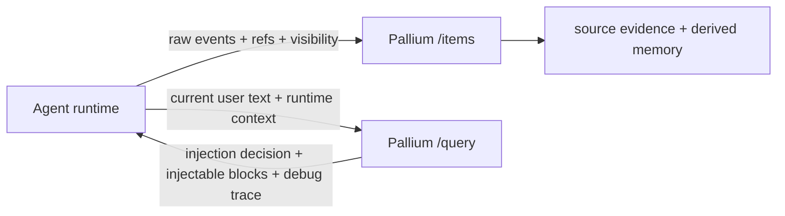

# Agent Integration Guide

This guide explains how to integrate Pallium with an agent runtime today.

Short version: the runtime decides which upstream events to send and when to
query. Pallium decides what is worth remembering, how to package it, and when a
returned memory block is useful to inject.

## Where Pallium Fits

Pallium sits on the edge of your runtime:

- your runtime owns the live conversation, tools, and user interaction
- Pallium owns selected evidence, derived memory, retrieval, ranking, and
  injectability judgment
- original systems stay the system of record

The intended model is:

- agent owns transport and runtime facts
- Pallium owns memory judgment

If the agent starts doing phrase filtering, memory-kind preference, local
reranking, or injectability policy, the integration has become a second memory
engine.

## One Concrete Flow

A realistic current-package loop looks like this:

1. a user asks why a background job keeps missing status updates
2. the assistant investigates and answers with a concrete decision
3. the runtime stores the user message, the assistant output, and a compact tool
   summary or next-step artifact
4. later the user asks the same question again, or the work is resumed after an
   interruption
5. the runtime queries Pallium before building the next prompt
6. Pallium returns a compact conclusion or work-state card plus supporting
   evidence refs

That is the present value story. Pallium is not trying to be the whole runtime.

## When To Ingest

Use `POST /items` when your runtime sees an event that is worth future reuse.

Good ingest moments:

- a user message establishes a new question or requirement
- an assistant answer contains a conclusion you want to carry forward
- a tool run produced a compact explicit finding worth preserving
- the runtime has an explicit progress update, blocker state, or next-step note

Avoid ingesting:

- every token or partial assistant draft
- raw tool logs
- raw MCP traffic
- ambient messages that never flowed through the agent

The current package is designed for bounded, intentional ingest. The runtime
should perform only mechanical validation here, such as empty-payload rejection
or obvious duplicate suppression. Semantic filtering belongs in Pallium.

## What To Ingest Today

The runtime sends events. Pallium decides what is worth remembering.

If your runtime can provide `artifact_kind` and `role` cheaply (e.g. the
runtime already knows it is forwarding a user message vs. an assistant reply),
include them — they help Pallium route faster. But these are hints, not
classification requirements. The semantic layer extracts meaning from content.

Common shapes that work well today:

- user question or requirement
  - `artifact_kind="message"`, `role="user"`
- final assistant answer or decision
  - `artifact_kind="assistant_output"`, `role="assistant"`
- explicit tool-derived finding or blocker summary
  - `artifact_kind="tool_use_summary"`, `role="assistant"`
- explicit next-step snapshot
  - `artifact_kind="todo_snapshot"`, `role="assistant"`

The content should be the compact text you want Pallium to reason over. The
current semantic layer is text-oriented; keep the text explicit and bounded.

## Item Request Contract

See [http-api.md — POST /items](http-api.md#post-items) for exact fields and
examples.

Practical guidance:

- make `source_id` stable and unique per upstream event
- use `content_type="text/plain"` unless you are deliberately handling another
  text-compatible format
- keep `source_ref` if you want to point users or tooling back to the origin
- always send `container_ref` for `agent_conversation_memory`

Repeated ingest for the same item should be idempotent when the source identity
is stable.

## Query Patterns

Use `POST /query` when the runtime needs memory for:

- repeated questions
- "why did we choose this?"
- "what did the investigation find?"
- resumed work after an interruption
- cross-thread continuity in the same bounded context

Useful query filters:

- `container_ref`
- `thread_ref`
- `artifact_kind`
- `role`
- `source_type`

Use `POST /query/debug` when:

- a result seems missing
- a higher-level memory kind is beating lower-level evidence unexpectedly
- you need to inspect visibility exclusions
- you need to see lexical matched tokens and text views

For local exploratory work, the supported way to exercise this integration
boundary is `python -m app.agent_simulation`. Use `chat-lite` when you want a
normal chat loop, or plain `chat` when you want operator-visible accept/edit/discard
and artifact capture. The harness stays on the real HTTP contract, keeps same-thread
local chat context in the app layer, keeps Pallium-approved carry-forward in a separate
prompt section, and shows Pallium's decision path without adding a second memory policy
in the client. When `prompt_toolkit` is available, the harness also adds slash-command
completion and colorized prompts plus role-prefixed output for agent/system/debug lines.

## Query Input Contract

See [http-api.md — POST /query](http-api.md#post-query) for exact fields and
examples.

The runtime should send:

- current user text
- refs and visibility:
  - `container_ref`
  - `container_visibility`
  - `thread_ref`

Optional advanced hints:
- `runtime_context` when the runtime genuinely knows a special state, for example:
  - `turn_kind = resumed_session`
  - an explicit override that local context is or is not sufficient

Normal agents should not need to send `runtime_context` for ordinary chat flow.
The structural refs are the primary contract; `runtime_context` is an optional
mechanical override channel, not a semantic instruction channel.

## Query Result Contract

See [http-api.md — POST /query](http-api.md#post-query) for the full response
shape and field reference.

The key fields for integration:

- `should_inject` — whether to inject memory into the agent's prompt
- `decision_reason` — why (e.g. `"carry_forward_available"`,
  `"no_relevant_memory"`)
- `injectable_blocks` — ready-to-use blocks with title, text, and evidence

The downstream agent should not need to decide:

- whether `task_checkpoint` beats `thread_summary`
- whether a greeting summary should be suppressed
- how many weak candidates to drop locally

For the harness specifically, same-thread local transcript continuity is handled in the
app layer as ordinary chat behavior, while cross-thread carry-forward remains a Pallium
decision. That keeps the integration boundary honest: runtime-owned local chat context on one
side, Pallium-owned memory judgment on the other.

## Suggested Runtime Loop

One practical runtime pattern:

1. ingest user message after it is accepted into the thread
2. ingest final assistant answer when it contains a reusable conclusion
3. ingest a compact tool-use summary only when it adds explicit finding,
   blocker, or next-step value
4. on repeated questions or resumed work, query Pallium before building the
   next prompt and include runtime context if it is available
5. inject Pallium's returned carry-forward block(s) directly when
   `should_inject=true`
6. if a result looks wrong, inspect `POST /query/debug` before changing prompts
   or retrieval code

The direct harness follows this same loop. In `chat-lite` mode it ingests the
user turn through `/items`, calls `/query/debug` before the assistant turn, and
auto-accepts the assistant reply after the model draft. In `chat` mode it keeps
the same HTTP flow but adds operator prompts for accept/edit/discard and optional
artifact capture. In both modes, only `injectable_blocks` are passed to the model
when Pallium says to inject. Ranked results and debug trace stay operator-visible,
not prompt-visible.

## How To Think About The Current Memory Jobs

The current package is optimizing for a few concrete jobs:

- remembering prior conclusions
- remembering investigation findings
- remembering thread orientation
- remembering where interrupted work left off
- carrying forward bounded cross-thread context when useful

The implementation uses multiple memory kinds internally to serve those jobs,
but the integration loop does not require you to think in those terms first.

## Integration Checklist

- send only agent-mediated, high-value events
- keep stable source identifiers
- preserve upstream refs so evidence remains actionable
- send `container_ref` on every ingest and query
- query before prompt-building when continuity matters
- keep local seam rules mechanical rather than semantic
- use the debug endpoint before changing heuristics blindly

## Boundaries

Pallium is the memory layer, not an authorization service or agent runtime.
The downstream agent should be a thin client that provides runtime facts and
accepts Pallium's memory decisions — not a second memory engine.

Pallium does not yet support:

- cross-container shared memory
- automatic ingestion from arbitrary upstream systems
- authorization on behalf of your app
