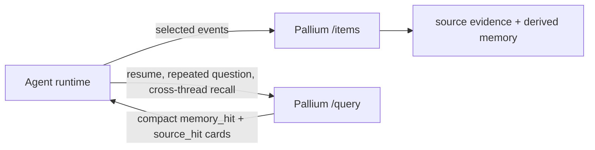

# Agent Integration Guide

This guide explains how Pallium is supposed to be used by an agent runtime
today.

The short version: Pallium is a memory sidecar. Your runtime decides what to
send, when to query, and how to use the returned memory in prompts or planning.

## Where Pallium Fits

Pallium should sit on the edge of your runtime:

- your runtime owns the live conversation, tools, and user interaction
- Pallium owns selected evidence, derived memory, and retrieval
- original systems stay the system of record

## When To Ingest

Use `POST /items` when your runtime sees an event that is worth future reuse.

Good ingest moments:

- a user message establishes a new question or requirement
- an assistant answer contains a conclusion you want to carry forward
- a tool run produced a compact explicit finding worth preserving
- the runtime has an explicit progress update, blocker state, or next-step note

Avoid ingesting:

- every token or partial assistant draft
- raw tool logs
- raw MCP traffic
- ambient messages that never flowed through the agent

The current package is designed for bounded, intentional ingest.

## What To Ingest Today

Current high-value artifact shapes:

- user question or requirement
  - `artifact_kind="message"`
  - `role="user"`
- final assistant answer or decision
  - `artifact_kind="assistant_output"`
  - `role="assistant"`
- explicit tool-derived finding or blocker summary
  - `artifact_kind="tool_use_summary"`
  - `role="assistant"`
- explicit next-step snapshot
  - `artifact_kind="todo_snapshot"`
  - `role="assistant"`

The content should be the compact text you want Pallium to reason over. The
current semantic layer is text-oriented; keep the text explicit and bounded.

## Item Request Contract

`POST /items` accepts:

- required:
  - `source_type`
  - `source_id`
  - `content_type`
  - `content`
- useful routing and evidence refs:
  - `container_ref`
  - `thread_ref`
  - `session_ref`
  - `actor_ref`
  - `source_ref`
  - `artifact_kind`
  - `role`
- package selection:
  - `use_case`
- privacy boundary:
  - `visibility_context`

Practical guidance:

- make `source_id` stable and unique per upstream event
- use `content_type="text/plain"` unless you are deliberately handling another
  text-compatible format
- keep `source_ref` if you want to point users or tooling back to the origin
- always send `visibility_context` for `agent_conversation_memory`

Repeated ingest for the same item should be idempotent when the source identity
is stable.

## Query Patterns

Use `POST /query` when the runtime needs memory for:

- repeated questions
- "why did we choose this?"
- "what did the investigation find?"
- resumed work after an interruption
- cross-thread continuity in the same bounded context

Useful query filters:

- `container_ref`
- `thread_ref`
- `session_ref`
- `artifact_kind`
- `role`
- `source_type`

Use `POST /query/debug` when:

- a result seems missing
- a higher-level memory kind is beating lower-level evidence unexpectedly
- you need to inspect visibility exclusions
- you need to see lexical matched tokens and text views

## Query Result Contract

Pallium returns compact cards rather than full raw payloads.

Result kinds:

- `memory_hit`
  Derived memory such as `decision`, `investigation_outcome`, `thread_summary`,
  `pattern_memory`, `continuity_memory`, or `task_checkpoint`.
- `source_hit`
  Compact evidence card with refs, excerpt, and visibility context.

Every `memory_hit` carries evidence refs back to supporting source items.

That means an agent can:

- use the memory object for fast orientation
- keep source evidence available for grounding or verification
- decide whether to fetch the original source from the system of record

## Suggested Integration Loop

One practical runtime pattern:

1. ingest user message after it is accepted into the thread
2. ingest final assistant answer when it contains a reusable conclusion
3. ingest a compact tool-use summary only when it adds explicit finding,
   blocker, or next-step value
4. on repeated questions or resumed work, query Pallium before building the
   next prompt
5. feed a small number of top `memory_hit` and `source_hit` cards into the
   runtime prompt or planner
6. if a result looks wrong, inspect `POST /query/debug` before changing prompts
   or retrieval code

## How To Think About The Memory Types

The current package uses different memory layers for different jobs:

- `decision`
  best for precise past conclusions
- `investigation_outcome`
  best for concrete findings and why they matter
- `thread_summary`
  best for compact thread orientation
- `pattern_memory`
  best for broader recurring recall across bounded prior work
- `continuity_memory`
  best for repeated-answer carry-forward
- `task_checkpoint`
  best for resumed-work state, blockers, and next steps

The package already reranks these differently depending on the query shape. You
do not need to send an explicit intent parameter today.

## Integration Checklist

- send only agent-mediated, high-value events
- keep stable source identifiers
- preserve upstream refs so evidence remains actionable
- send `visibility_context` on every ingest and query
- query before prompt-building when continuity matters
- use the debug endpoint before changing heuristics blindly

## Current Limits

Do not design your integration as if Pallium already supports:

- vector retrieval
- hybrid fusion
- cross-container shared memory
- automatic ingestion from arbitrary upstream systems
- authorization on behalf of your app

Those remain outside the current contract.