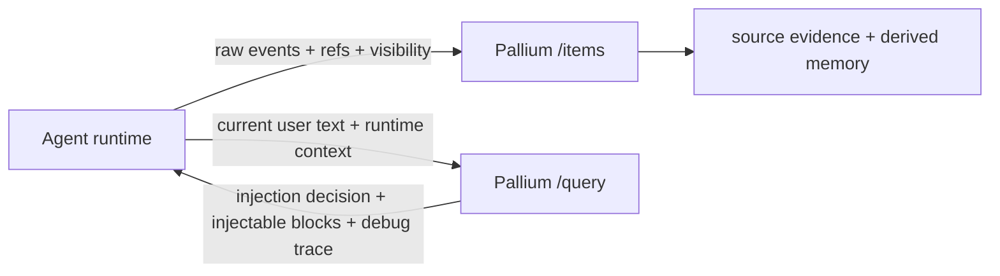

# Agent Integration Guide

This guide explains how to integrate Pallium with an agent runtime today.

Short version: the runtime decides which upstream events to send and when to
query. Pallium decides what is worth remembering, how to package it, and when a
returned memory block is useful to inject.

## Where Pallium Fits

Pallium sits on the edge of your runtime:

- your runtime owns the live conversation, tools, and user interaction
- Pallium owns selected evidence, derived memory, retrieval, ranking, and
  injectability judgment
- original systems stay the system of record

The intended model is:

- agent owns transport and runtime facts
- Pallium owns memory judgment

If the agent starts doing phrase filtering, memory-kind preference, local
reranking, or injectability policy, the integration has become a second memory
engine.

## One Concrete Flow

A realistic current-package loop looks like this:

1. a user asks why reservation ordering keeps missing hold updates
2. the assistant investigates and answers with a concrete decision
3. the runtime stores the user message, the assistant output, and a compact tool
   summary or next-step artifact
4. later the user asks the same question again, or the work is resumed after an
   interruption
5. the runtime queries Pallium before building the next prompt
6. Pallium returns a compact conclusion or work-state card plus supporting
   evidence refs

That is the present value story. Pallium is not trying to be the whole runtime.

## When To Ingest

Use `POST /items` when your runtime sees an event that is worth future reuse.

Good ingest moments:

- a user message establishes a new question or requirement
- an assistant answer contains a conclusion you want to carry forward
- a tool run produced a compact explicit finding worth preserving
- the runtime has an explicit progress update, blocker state, or next-step note

Avoid ingesting:

- every token or partial assistant draft
- raw tool logs
- raw MCP traffic
- ambient messages that never flowed through the agent

The current package is designed for bounded, intentional ingest. The runtime
should perform only mechanical validation here, such as empty-payload rejection
or obvious duplicate suppression. Semantic filtering belongs in Pallium.

## What To Ingest Today

Current high-value artifact shapes:

- user question or requirement
  - `artifact_kind="message"`
  - `role="user"`
- final assistant answer or decision
  - `artifact_kind="assistant_output"`
  - `role="assistant"`
- explicit tool-derived finding or blocker summary
  - `artifact_kind="tool_use_summary"`
  - `role="assistant"`
- explicit next-step snapshot
  - `artifact_kind="todo_snapshot"`
  - `role="assistant"`

The content should be the compact text you want Pallium to reason over. The
current semantic layer is text-oriented; keep the text explicit and bounded.

## Item Request Contract

`POST /items` accepts:

- required:
  - `source_type`
  - `source_id`
  - `content_type`
  - `content`
- useful routing and evidence refs:
  - `container_ref`
  - `thread_ref`
  - `session_ref`
  - `actor_ref`
  - `source_ref`
  - `artifact_kind`
  - `role`
- package selection:
  - `use_case`
- privacy boundary:
  - `visibility_context`

Practical guidance:

- make `source_id` stable and unique per upstream event
- use `content_type="text/plain"` unless you are deliberately handling another
  text-compatible format
- keep `source_ref` if you want to point users or tooling back to the origin
- always send `visibility_context` for `agent_conversation_memory`

Repeated ingest for the same item should be idempotent when the source identity
is stable.

## Query Patterns

Use `POST /query` when the runtime needs memory for:

- repeated questions
- "why did we choose this?"
- "what did the investigation find?"
- resumed work after an interruption
- cross-thread continuity in the same bounded context

Useful query filters:

- `container_ref`
- `thread_ref`
- `session_ref`
- `artifact_kind`
- `role`
- `source_type`

Use `POST /query/debug` when:

- a result seems missing
- a higher-level memory kind is beating lower-level evidence unexpectedly
- you need to inspect visibility exclusions
- you need to see lexical matched tokens and text views

## Query Input Contract

The runtime should send:

- current user text
- refs and visibility:
  - `container_ref`
  - `thread_ref`
  - `session_ref`
  - `visibility_context`
- a small amount of explicit runtime context when available, for example:
  - `turn_kind = new_thread | same_thread_continuation | resumed_session | new_session`
  - whether the active session already has sufficient local context

That runtime context is mechanical, not semantic. The runtime should describe
its world, not guess what memory kind should win.

## Query Result Contract

Pallium should return integration-ready memory decisions rather than forcing the
agent to infer injectability from generic ranked candidates.

Expected response shape direction:

- `should_inject`
- `decision_reason`
- `injectable_blocks` or `injectable_results`
- optional raw or debug trace on the debug path

Example `decision_reason` values:

- `carry_forward_available`
- `same_thread_context_sufficient`
- `no_relevant_memory`
- `only_low_value_candidates`

Result kinds:

- `memory_hit`
  derived memory such as prior conclusions, investigation findings, thread
  orientation, or resumed-work state
- `source_hit`
  compact evidence card with refs, excerpt, and visibility context

Every `memory_hit` carries evidence refs back to supporting source items.

That means an agent can:

- use the memory object for fast orientation
- keep source evidence available for grounding or verification
- decide whether to fetch the original source from the system of record

The downstream agent should not need to decide:

- whether `task_checkpoint` beats `thread_summary`
- whether a greeting summary should be suppressed
- whether same-thread context is enough
- how many weak candidates to drop locally

Those are Pallium decisions.

## Suggested Runtime Loop

One practical runtime pattern:

1. ingest user message after it is accepted into the thread
2. ingest final assistant answer when it contains a reusable conclusion
3. ingest a compact tool-use summary only when it adds explicit finding,
   blocker, or next-step value
4. on repeated questions or resumed work, query Pallium before building the
   next prompt and include runtime context if it is available
5. inject Pallium's returned carry-forward block(s) directly when
   `should_inject=true`
6. if a result looks wrong, inspect `POST /query/debug` before changing prompts
   or retrieval code

## How To Think About The Current Memory Jobs

The current package is optimizing for a few concrete jobs:

- remembering prior conclusions
- remembering investigation findings
- remembering thread orientation
- remembering where interrupted work left off
- carrying forward bounded cross-thread context when useful

The implementation uses multiple memory kinds internally to serve those jobs,
but the integration loop does not require you to think in those terms first.

## Integration Checklist

- send only agent-mediated, high-value events
- keep stable source identifiers
- preserve upstream refs so evidence remains actionable
- send `visibility_context` on every ingest and query
- query before prompt-building when continuity matters
- keep local seam rules mechanical rather than semantic
- use the debug endpoint before changing heuristics blindly

## Current Limits

Do not design your integration as if Pallium already supports:

- vector retrieval
- hybrid fusion
- cross-container shared memory
- automatic ingestion from arbitrary upstream systems
- authorization on behalf of your app

Also do not design your integration as if the downstream agent should own the
memory policy. The target boundary is a thin client that provides runtime facts
and accepts Pallium's memory decisions.

## Read Next

- API reference: [http-api.md](http-api.md)
- privacy rules: [privacy-and-visibility.md](privacy-and-visibility.md)
- memory structure and lifecycle: [memory-model.md](memory-model.md)
- deeper concepts: [overview.md](overview.md)
