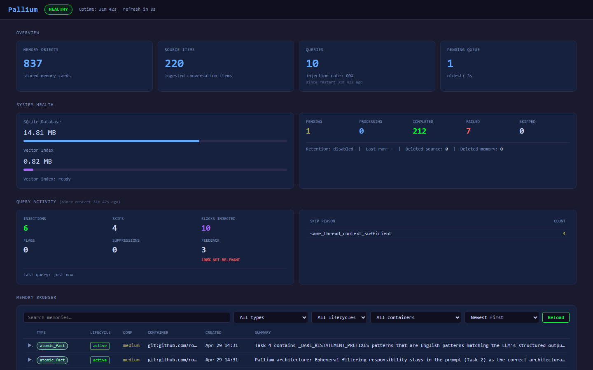

# Dashboard

Pallium includes a browser-based dashboard for inspecting stored memories,
viewing evidence chains, checking system health, and debugging query behavior.

## Access

Open in your browser:

- **Service mode:** http://localhost:19836/dashboard
- **Dev mode:** http://localhost:8000/dashboard

No authentication required — the dashboard is localhost-only, same as the API.

## Features

### Overview

Four metric cards showing at a glance:

- **Memory Objects** — total stored memory cards
- **Source Items** — total ingested conversation items
- **Queries** — query count with injection rate (ephemeral, since restart)
- **Pending Queue** — items awaiting processing

### System Health

- **Storage** — SQLite database and vector index sizes with proportional bars
- **Processing Queue** — pending/processing/completed/failed/skipped counts
  plus retention status

### Query Activity

Breakdown of query behavior since last restart:

- Injections, skips, blocks injected, flags, suppressions, feedback totals
- Skip reasons table showing why queries didn't produce injections
- Contextual coloring when injection rate is low or failures are present

### Memory Browser

The main view lists all stored memory objects with:

- **Search** — server-side text search across memory payloads
- **Filtering** by memory type, lifecycle state, and container
- **Sorting** by creation date or negative feedback count
- **Pagination** for large memory stores
- **Absolute timestamps** (e.g., `Apr 16 17:57`)

Each row shows the memory type, lifecycle, confidence level, container,
creation timestamp, and summary text.

### Memory Detail

Click any memory to see:

- **ID** with copy-to-clipboard button (for use with `pallium_flag_memory`)
- **Content fields** — decision, rationale, summary, interest_text, etc.
  displayed as structured key-value pairs
- **Technical metadata** — semantic provenance, source info (collapsed)
- **Feedback history** — relevant/not_relevant ratings with reasons
- **Evidence** — source conversation items grouped by thread, ordered
  chronologically

### Query Debug

Collapsible panel at the bottom for testing queries interactively:

- Enter query text and optionally select a container
- Calls `POST /query/debug` and shows:
  - Whether injection would occur (INJECT/SKIP)
  - Decision reason
  - Injectable memory blocks
  - Retrieval stage trace (candidates and selections per stage)

### Feedback

The dashboard shows aggregated feedback counts (relevant vs. not_relevant)
per memory. Feedback is submitted by agents via the `pallium_rate_memory`
MCP tool during normal operation — the dashboard surfaces it for inspection.

## When to Use

- **Monitoring health** — confirm the service is up, memories are being
  created, and processing is active
- **Debugging retrieval** — use Query Debug to test what memories would be
  injected for a given query
- **Verifying extraction** — inspect the content fields Pallium derived from
  conversation turns
- **Reviewing feedback** — sort by "Most negatively rated" to surface
  memories that agents consistently find irrelevant
- **Investigating skips** — check skip reasons to understand why queries
  aren't producing injections

## Dark Theme

The dashboard uses a dark theme by default with no toggle needed.
