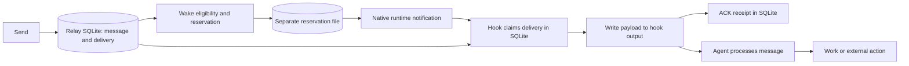

# Relay wake architecture review and rework plan

Reviewed baseline: `01b3f06564cd10a35e90df573c45432d9e9c5e84`, 2026-09-29.
Status: architecture recommendation; no delivery-contract change implemented.
Canonical roadmap: [Add wake-first Relay delivery](../../roadmap/features/add-wake-first-relay-delivery.md).

## Recommendation

Use Relay's existing SQLite database for transactional wake reservations. Treat wake as a retryable notification that points to a durable message, not as a second delivery system. Make receipt, possible redelivery, and completed work distinct. Prefer bounded at-least-once notification and payload delivery where the runtime permits it, with ordinary duplicate suppression; do not promise exactly-once downstream actions.

This is not a reason to remove exact recipient identity, lower-authority attribution, atomic claims, stale-receipt rejection, or safe runtime admission. Those protect different things. Do not move every local file into SQLite: offline hook handoff and protected runtime connection material have different ownership and availability needs.

Stop expanding the held JSON recovery patch. Reuse its failure cases in the database implementation. Keep the experimental Desktop bridge separate until the shipped wake path and diagnostics are understandable. No new live trial is part of this review.

## What the current system actually guarantees



The write to hook output, ACK, model processing, and external action are not one transaction. If ACK commits and the host then fails before consuming the hook output, there is no model-consumption receipt that would trigger replay. This is a plausible loss window inferred from the boundary, not a reproduced host crash. Current behavior therefore establishes neither exactly-once nor guaranteed at-least-once model consumption.

| Boundary | Current behavior | Consequence |
|---|---|---|
| Send accepted | Message and recipient delivery are persisted in SQLite. | Saved does not mean woken or read. |
| Wake reserved | One current endpoint reservation is persisted separately; accepted/uncertain submissions remain fenced. | Conservative duplicate-notification prevention can strand pending work until a natural turn. |
| Hook claim | SQLite serializes claims and leases; expired claims may be claimed again. | Concurrent ownership is controlled, but later redelivery is possible. |
| Payload emitted | Hook writes and flushes output, then ACKs. | Crash or ACK failure after output can lead to repeated context admission. Local flush is not proof of model consumption. |
| ACK / delivered | Receipt is recorded and the reservation can be released. | Does not prove the requested work started or completed. |
| Agent side effect | Outside Relay's transaction. | Exactly-once execution is not guaranteed by Relay, ACK, or an instruction prompt. |

Sources: `storage/sqlite_relay.py:823-930`, `integrations/codex/hooks/user_prompt_submit.py:209-233`, `integrations/codex/hooks/common.py:761-788`, and `docs/agent-relay.md:195-218`. The older plan's “exactly-once context admission” language overstates the implemented boundary; reconcile that wording during the contract/documentation slice.

## Prioritized findings

### 1. Split transactional authority and process-wide persistence failure — high

SQLite owns delivery/claim state while `core/codex_wake.py` owns a second durable reservation state in `reservations.json`. Failed mutation sets `_usable=False`; later reservations are refused for every endpoint in that process. Recovery repeatedly selecting candidates does not repair that condition. A recent incident is consistent with failed file replacement followed by this behavior; the exact Windows error and introduction revision remain unproved.

The file was a deliberate scope compromise in the earlier activation-contract task: no new schema, bounded current reservations, single service owner. It was not selected because files are a better transactional store. The older wake-first design already located transitions in SQLite. Rebuilding commit verification, retry, and synchronization around JSON adds machinery the existing database should own.

**Change:** migrate current reservation metadata into Relay SQLite. Keep malformed migration state fail-closed and visible. A database busy/error result must not silently mark all wake scheduling permanently unavailable. Do not erase unresolved reservations to restore green health.

Sources: `core/codex_wake.py:1-76,249-318`; `.agent-workflow/tasks/relay-activation-contract.md`; `docs/plans/2026-08-26-wake-first-relay-delivery.md:112-113`.

### 2. Recovery holds a database write transaction across file mutation and scheduling — high

`relay_reconcile_codex_wake_reservation` calls a supplied decision function inside `_begin_relay_immediate()`. The current callback replaces the JSON reservation and starts scheduling a worker. This couples a SQLite writer lock to another persistence mechanism and worker startup. It is a source-proven coupling, not a demonstrated deadlock in the reported incident.

**Change:** perform eligibility, reservation generation and conditional state transitions in one short database transaction. Return the committed work item; launch native work only after commit. Preserve the existing ownership guard outside SQLite transactions: current-generation validation and initiation of the non-idempotent native submission must remain indivisible with respect to release/replacement. Conditional result settlement alone prevents stale state writes, not a stale worker's native submission. Settle results with a conditional generation check in a separate transaction. Do not hold a database transaction while calling the runtime. See `core/codex_wake.py:80-85` and `app/codex_wake.py:545`.

Sources: `storage/sqlite_relay.py:1733-1746`; `app/codex_wake.py:128-181`.

### 3. Operational health can hide a disabled wake subsystem — high

The normal health/embedding/queue checks do not establish that wake scheduling is usable. Activation may report unknown, while best-effort trace recording can itself lose evidence. A healthy memory service with broken wake is possible. Logs that collapse all connection failures to `native-failed` cannot distinguish opening, peer validation, protocol I/O, or proof publication.

**Change:** expose a compact wake-subsystem status in existing operational surfaces: usable/degraded, bounded reason, last recovery progress, pending/oldest eligible work and unresolved attempts. Preserve ordinary service liveness separately. Record fixed failure stages/categories before normalization and count trace loss; no credentials, endpoints, raw responses or exception strings. Absence of trace is not proof that native dispatch did not occur.

Sources: `app/dependencies.py:756-778`; `core/codex_wake.py:249-318`; `core/service.py:2296`; `core/relay.py:705-713`; `app/codex_bridge_pipe.py:1097-1102,1390-1452,1552-1561`.

### 4. Redelivery is possible, but the agent envelope does not say so — high

The stored delivery already carries `attempts`; rendered hooks show stable `message_id` and `delivery_id` but omit the claim attempt and a possible-redelivery warning. Existing claim leases already allow redelivery after the emit/ACK gap. The model should not have to infer this from an opaque identifier.

**Change:** render `claim_attempt` and `possible_redelivery` from existing claim data, with common guidance across integrations. An attempt greater than one means the payload might have been seen; it is not proof it was previously emitted. Do not treat first-attempt metadata as proof of no prior business action, or deduplicate by matching message text.

Sources: `storage/sqlite_relay.py:206-228`; `integrations/codex/hooks/common.py:1452-1466`.

### 5. Runtime availability and locking need narrower failure domains — medium

Claude's registry-wide lock spans persistence, eligibility and native writes. Contention can make status unknown and delay unrelated endpoints. Its global default wake directory is not isolated by Relay database; this is an existing known isolation issue, not a new discovery. Fail-closed rehydration states also need explicit operator-visible diagnosis and a safe recovery path.

**Change:** preserve the runtime-specific admission rules while separating database metadata from protected live capabilities. Scope stores to the correct service/database. Move bounded native I/O outside a global registry lock using exact per-attempt ownership; do not simply remove locking. Address Claude in a separate slice after Codex, rather than rewriting all adapters together.

Sources: `core/claude_wake.py:165,253-374`; `app/claude_wake.py`; canonical roadmap RW-033.

### 6. Worker shutdown and experimental qualification are not one lifecycle — medium

Wake workers are daemon threads; stopping the reconciler is not the same as draining every admitted native attempt before storage closes. The source shows a shutdown exposure, not evidence this caused the current outage. Separately, the inventory bridge deliberately uses finite authority, exact peers and RAM custody; those controls address capability security, not message deduplication.

**Change:** give admitted workers explicit service ownership, stop new admission before shutdown, bound drain, and preserve uncertain outcomes durably. Keep the optional bridge isolated and off by default. Qualify only the useful after-normal-chat bootstrap case. Never archive the user's test chat for process exit or cleanup; observe natural exit and report an inconclusive lifetime witness if absent.

Sources: `app/codex_wake.py:380-390`; `app/claude_wake.py:174`; `app/main.py:340-359`; `docs/designs/codex-mcp-desktop-bridge.md`.

## At-least-once: three separate decisions

| Layer | Recommended contract | What remains necessary |
|---|---|---|
| Wake notification | Bounded retry/coalescing while the delivery remains pending and recipient is eligible; duplicate or overtaken wakes may occur. | Runtime-safe admission, backoff/cost budget, one active dispatch owner, suppression of empty/overtaken wake turns where supported. Do not repeatedly queue behind a busy turn without a bound. |
| Payload receipt | Explicit possible-redelivery semantics; retain atomic claims and stale-receipt rejection. | Stable delivery ID, lease ownership, expiry, exact recipient scope, duplicate envelope. Receipt remains distinct from completion. |
| Requested work | Agent checks whether the exact delivery was already handled. External operations use their native idempotency/readback when needed. | Never promise exactly-once external effects. Unknown outcome requires checking the actual target before repeating an irreversible action. |

At-least-once is a proposed operating model, not a claim that this hook integration guarantees eventual model consumption. Availability, retention, bounded notification retries and the ACK/host-consumption gap limit it. Unsupported/unavailable runtimes can still leave a message pending until a natural turn. Call the implemented notification policy bounded retry, not unconditional at-least-once delivery. Stronger admission needs a supported durable host receipt/readback; an agent prompt cannot supply one.

Proposed envelope, using existing identity and attempts rather than a new message store:

```text
message_id: <stable message ID>
delivery_id: <stable recipient delivery ID>
claim_attempt: 2
possible_redelivery: true
This delivery may have been seen before. Check prior handling of this exact ID.
If completed, do not repeat its actions. If the outcome is unknown, inspect the
target state before retrying irreversible work. ACK means receipt, not completion.
```

Use current chat context and the existing task/work artifact first. A substantive prior result is useful evidence; no result is not proof that no side effect occurred. Preserve lower-authority attribution and hook-owned claim/ACK. Do not instruct the agent to call receive or ACK again for an injected hook delivery. Stable reply deduplication already exists; it does not deduplicate arbitrary work performed before that reply.

Do not add a universal action ledger, payload hash deduplicator, or automatic completion inference. If a specific workflow needs durable work completion, use its existing work record or downstream idempotency key. A later common completion capability should be justified by concrete use cases.

## Implementation sequence

Each slice uses its own Work Record, scoped tests, independent review and normal PR/CI. Existing held drafts are evidence, not approved implementation.

| Slice | Deliverable and acceptance | Dependency |
|---|---|---|
| A. Honest diagnostics and envelope | Wake degradation becomes visible; hook output exposes possible redelivery without changing claim/ACK semantics; fixed native failure categories contain no secrets. E2E checks emission/ACK failure, prior claim without emission, stale receipt and unchanged lower-authority attribution. | Can proceed without changing accepted-wake retry policy. Reuse the held diagnostic proposal only after aligning scope. |
| B. SQLite reservation authority | Current Codex reservations migrate once; reserve/claim eligibility and generation changes use short transactions; native I/O starts after commit under an exact current-generation ownership guard. Released/replaced workers cannot submit. No production JSON mutation path remains for these reservations. | Preserve current conservative accepted/uncertain behavior initially, so storage correctness is independently testable. |
| C. Bounded at-least-once wake | Replace indefinite ambiguity fencing with a reviewed retry/coalescing policy for qualified adapters. Pending delivery and exact admission are rechecked; duplicate notifications cannot cause concurrent payload claims or unbounded queued turns. | Requires explicit approval of the precise protected behavior change below and adapter-specific evidence. |
| D. Lifecycle and remaining runtime isolation | Worker admission/drain is service-owned; Claude's database isolation and global-lock failure domain are corrected without weakening idle-only admission. | Reuse B patterns where applicable; do not force shared credential storage or identical runtime behavior. |
| E. Unloaded Codex availability | Use stage diagnostics to localize the actual bridge failure, then prove one retained connection and one genuine unloaded-recipient delivery under a reviewed bounded trial. | A and safe restored test state; no archiving, forced child exit, Desktop restart requirement or repeated bootstrap research. Lifetime absence remains inconclusive. |

### Database migration and failure checks

Use the existing Relay database and storage layer, not a new database/service/queue framework. A bounded current-reservation table needs endpoint uniqueness, stable delivery reference, generation, outcome and existing claim correlation; timestamps/retry metadata are added only for the chosen retry contract.

Migration requires exclusive ownership: stop the old service and drain its admitted workers before reading/importing legacy state, using the installed Windows restart wrapper for that deployment. Do not allow concurrent file-owning and SQLite-owning binaries. Keep new dispatch disabled until the import transaction and its verification complete. Atomically import valid legacy reservations and a migration marker. Preserve reserved, accepted and uncertain rows. Corrupt, conflicting or unreadable legacy state produces an explicit degraded state, not an empty successful migration. Re-running migration cannot resurrect stale file entries or reset current database rows. Preserve the original file until import is verified. Rollback must not run an old file-only binary against newer database-owned attempts; document a quiesced, reconciled rollback or forward-fix policy.

Test crash boundaries before/after import commit, reserve commit, native submission and result settlement; expired versus active claims; late callbacks against replaced generations; concurrent natural turn and wake; SQLite busy/transaction failure; bounded retry exhaustion; restart with accepted/uncertain work; corrupt/conflicting legacy input. Add a caller-surface race asserting that released/replaced generations produce zero native submissions, preserving `tests/test_codex_wake.py:3124-3142`, and an upgrade check proving old file owners/workers cannot overlap the new SQLite owner. Use the real HTTP/hook surfaces with fake native transport where possible, plus the minimum platform witness needed. Run focused tests during development and the selector-required full suite once per coherent application change, not after documentation edits.

### Exact policy decision before slice C

Current protected behavior includes one accepted native queue submission across repeated recovery sweeps (`tests/behavior_contracts/test_codex_busy_wake.py:43-53,113-124,169-181`). Current uncertainty rules deliberately prevent blind resubmission. The user has authorized considering a change, not yet the exact before/after contract.

Proposed change: permit another bounded, coalesced native notification for the same still-pending delivery after the reviewed retry condition, even if a previous notification was accepted or uncertain; duplicates can occur. Keep exact recipient selection, no busy-turn interruption, atomic claims, stale-token rejection and overtaken-wake suppression. Specify retry condition, backoff, maximum outstanding work and cost bound in that implementation plan. If an adapter cannot bound duplicate queued work or safely admit at a turn boundary, retain its conservative behavior and report the limitation rather than enabling generic retries.

This decision does not authorize repeating a completed agent action or modifying stale-claim safety tests. Record exact task-owner approval before changing the protected accepted-wake contract; no new personal gate is needed for the independent storage/diagnostic slices already authorized.

## Held work and limitations

The JSON recovery draft is preserved, unshipped, and superseded as the default direction by SQLite planning. Its deterministic failure cases remain useful. The inventory-stage diagnostic draft is held for alignment with slice A. No service configuration, database, wake fence, test-chat state or application code changed in this review.

This audit uses shipped code and existing incident evidence. It does not establish the exact Windows file-replacement error, a runtime connection root cause, universal unloaded wake, exactly-once actions, or a measured deadlock. Known roadmap issues remain known issues. The canonical roadmap and current design wording must be reconciled when accepted slices are scheduled; historic qualification claims must not be rewritten as broader guarantees.

Review disagreement: the delivery reviewer correctly notes that native uncertainty survives a database migration and that split storage alone does not prove an outage. The manager nevertheless recommends SQLite because the observed process-wide file failure, separate-commit recovery, and proposed custom commit-verification machinery together justify consolidation into storage the product already uses. The file's original narrow scope was defensible; continuing to expand that compromise is not the preferred direction. Migration is an engineering recommendation, not a claim that SQLite removes all persistence failures.
