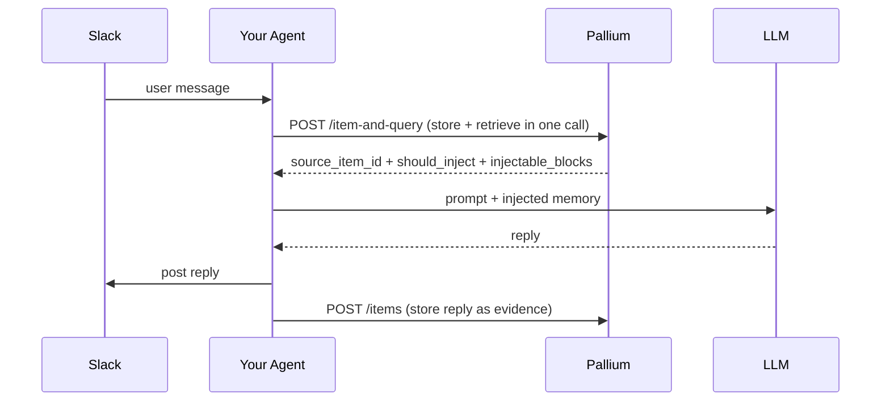

# Integration Example: Slack Agent

A concrete walkthrough showing how a Slack-connected agent integrates with
Pallium. Based on a real production integration pattern.

For API reference, see [http-api.md](http-api.md). For integration
principles, see [agent-integration.md](agent-integration.md).

## The Setup

Your agent listens to Slack events. When a user sends a message, the agent
answers using an LLM. Pallium sits between the Slack event and the LLM call —
it stores selected evidence, derives compact memory, and returns it before the
next answer so the agent can stay oriented across conversations.



The `/item-and-query` endpoint stores the user message as evidence for future
recall and retrieves previously derived memory in a single call. The
just-ingested message won't appear in query results — processing is async.

**When to use which endpoint:**

- **User messages** → `POST /item-and-query` — store the message AND get
  memory before drafting a reply. This is the only point where you need a
  query.
- **Assistant replies, tool summaries, todo snapshots** → `POST /items` —
  store as evidence for future recall. No query needed — the agent already
  has its answer, it's just preserving the result for later.

## Mapping Slack Concepts to Pallium Fields

| Slack concept | Pallium field | Example value |
|---------------|--------------|---------------|
| Channel ID | `container_ref` | `"slack:channel:C04ABC123"` |
| DM channel | `container_ref` | `"slack:dm:D01XYZ789"` |
| Thread timestamp | `thread_ref` | `"slack:thread:C04ABC123:1700000001.000100"` |
| Channel type | `visibility` | `"public"`, `"container"`, or `"private"` |
| Message timestamp | `source_id` | `"slack-message:C04ABC123:1700000001.000100"` |
| User ID | `actor_ref` | `"slack:user:U01XYZ789"` |
| Bot/agent ID | `agent_ref` | `"slack-bot:B04DEF456"` |

Slack-specific note: Slack identifies messages by `ts` — a string that looks
like a Unix timestamp (e.g. `"1700000001.000100"`) but is actually a unique ID
within a channel. The pair `(channel, ts)` is globally unique. Threads are
identified by the `ts` of the first message: replies carry `thread_ts`
pointing back to it. This is why `ts` works well as both `source_id` and
`thread_ref` — it's stable and unique.

`container_ref` groups related conversations. `visibility` controls
who can see the memory — a private channel's memory never leaks into queries
from a different context.

## The Client

A thin async client wraps the Pallium endpoints:

```python
import aiohttp

class PalliumClient:
    def __init__(self, base_url: str, timeout_seconds: int = 5):
        self._base_url = base_url.rstrip("/")
        self._timeout = aiohttp.ClientTimeout(total=timeout_seconds)
        self._session: aiohttp.ClientSession | None = None

    async def _ensure_session(self) -> aiohttp.ClientSession:
        if self._session is None or self._session.closed:
            self._session = aiohttp.ClientSession(timeout=self._timeout)
        return self._session

    async def item_and_query(self, payload: dict) -> dict | None:
        """Store item + query for memory in one call."""
        session = await self._ensure_session()
        async with session.post(f"{self._base_url}/item-and-query", json=payload) as r:
            if r.status != 200:
                return None
            return await r.json()

    async def post_items(self, items: list[dict]) -> list[dict]:
        """Store one or more items."""
        session = await self._ensure_session()
        async with session.post(f"{self._base_url}/items", json=items) as r:
            if r.status >= 400:
                logging.warning("Pallium ingest failed: HTTP %s", r.status)
                return []
            return await r.json()
```

## Step 1: Ingest + Query in One Call

When a Slack message arrives, store it and query for prior memory together:

```python
async def ingest_and_query(client: PalliumClient, event: dict) -> dict | None:
    channel = event["channel"]
    thread_ts = event.get("thread_ts") or event["ts"]

    return await client.item_and_query({
        "source_type": "conversation_agent_event",
        "source_id": f"slack-message:{channel}:{event['ts']}",
        "content_type": "text/plain",
        "content": event["text"],
        "role": "user",
        "artifact_kind": "message",
        "container_ref": container_ref(channel, event["user"], is_dm(event)),
        "thread_ref": f"slack:thread:{channel}:{thread_ts}",
        "visibility": channel_visibility(event),
        "actor_ref": f"slack:user:{event['user']}",
    })
```

Notes:
- `content` is used as both the stored evidence and the query text by default.
  Use `query_text` to override if you need different query text.
- `source_id` is stable per message — re-ingesting is idempotent.
- The ingest is async — the just-ingested message won't appear in query
  results. The query retrieves previously derived memory.

## Step 2: Build the LLM Prompt

Check `should_inject` and use `injectable_blocks` directly:

```python
async def handle_message(event: dict):
    # 1. Ingest + query
    result = await ingest_and_query(pallium, event)

    # 2. Build prompt with injected memory
    blocks = result["injectable_blocks"] if result and result.get("should_inject") else []
    parts = []
    if blocks:
        parts.append("[Prior context from earlier related work]")
        for block in blocks:
            title = block.get("title") or block.get("memory_type") or "context"
            parts.append(f"{title}\n{block['text']}")
        parts.append("[End prior context]\n")
    parts.append(f"User: {event['text']}")
    prompt = "\n\n".join(parts)

    # 3. Call LLM and post reply
    reply = await call_llm(prompt)
    reply_ts = await post_slack_reply(event, reply)

    # 4. Ingest reply and artifacts
    await ingest_assistant_artifacts(pallium, event, reply_ts, reply)
```

Don't filter, rerank, or second-guess — `should_inject` and
`injectable_blocks` are the contract. Pallium already made the decision.

## Step 3: Ingest the Assistant Reply and Artifacts

After the LLM responds, store the reply and any artifacts. Use batch ingest
to send them in a single call:

```python
async def ingest_assistant_artifacts(
    client: PalliumClient,
    event: dict,
    reply_ts: str,
    reply_text: str,
    tool_summary: str | None = None,
    todo_snapshot: str | None = None,
):
    channel = event["channel"]
    thread_ts = event.get("thread_ts") or event["ts"]
    shared = {
        "source_type": "conversation_agent_artifact",
        "content_type": "text/plain",
        "role": "assistant",
        "container_ref": container_ref(channel, event["user"], is_dm(event)),
        "thread_ref": f"slack:thread:{channel}:{thread_ts}",
        "visibility": channel_visibility(event),
        "agent_ref": f"slack-bot:{BOT_ID}",
    }

    items = [{
        **shared,
        "source_id": f"agent-artifact:{channel}:{reply_ts}:assistant_output",
        "content": reply_text,
        "artifact_kind": "assistant_output",
    }]

    if tool_summary:
        items.append({
            **shared,
            "source_id": f"agent-artifact:{channel}:{reply_ts}:tool_use_summary",
            "content": tool_summary,
            "artifact_kind": "tool_use_summary",
        })

    if todo_snapshot:
        items.append({
            **shared,
            "source_id": f"agent-artifact:{channel}:{reply_ts}:todo_snapshot",
            "content": todo_snapshot,
            "artifact_kind": "todo_snapshot",
        })

    # Batch ingest — one HTTP call for all artifacts
    await client.post_items(items)
```

`POST /items` accepts an array, so the reply, tool summary, and todo snapshot
go in a single round-trip. Format tool and todo content as compact text:

```python
# Tool summary example
"Tool summary: search_codebase [done]: found 3 matches in auth module | run_tests [done]: 12 passed"

# Todo snapshot example
"Todo snapshot: in_progress: implement rate limiting | pending: update API docs"
```

## Visibility Mapping

```python
def container_ref(channel: str, user: str, dm: bool) -> str:
    return f"slack:dm:{channel}" if dm else f"slack:channel:{channel}"

def channel_visibility(event: dict) -> str:
    if is_dm(event):
        return "private"
    if is_public_channel(event):
        return "public"
    return "container"  # private channels
```

## What You Don't Need to Do

- **Don't filter or rerank results** — `should_inject` and
  `injectable_blocks` are the contract.
- **Don't send `runtime_context`** for normal chat — the structural refs
  are sufficient. Only send it when you genuinely know the session state
  (e.g. `turn_kind: "resumed_session"` after a reconnect).
- **Don't send `use_case`** — server-side config selects the semantic package.
- **Don't ingest everything** — user questions and final assistant answers are
  the high-value inputs. Skip reactions, ephemeral messages, and bot noise.

## Debugging

When results are wrong, use the debug endpoint:

```python
result = await client.query_debug({
    "text": user_text,
    "container_ref": container_ref(channel, user, dm),
    "visibility": channel_visibility(event),
})

# result["trace"] shows retrieval matches, visibility exclusions,
# routing decisions, and why Pallium chose to inject or abstain
```
